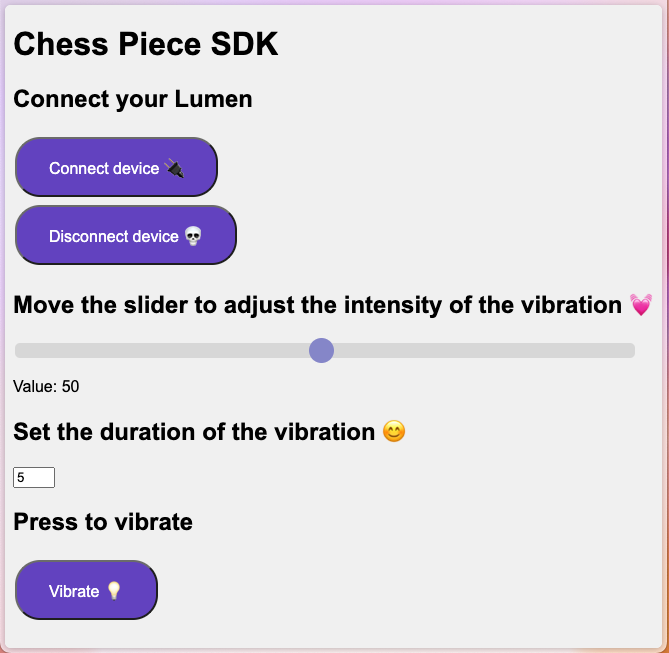

# Chess Piece SDK

This repository contains a single file, index.html, which provides an interface to connect to a [Lumen](https://www.kiiroo.com/products/ohmibod-lumen-powered-by-kiiroo) (or any other Bluetooth-enabled butt plug) and control its vibration level and duration from a Chromium-based browser.

The interface is designed to be user-friendly and easy to use. Users can set the level and duration of the vibration, and control it directly from the browser.

The purpose of this repository is to provide a simple and accessible way for users to interact with their Bluetooth butt plug. By making this code open-source, we hope to encourage other developers to contribute and improve the code, and to provide a platform for users to share their experiences and feedback.

## Usage

To use this code, simply open the index.html file in a Chromium-based browser. The interface will appear, allowing you to connect to your [Lumen](https://www.kiiroo.com/products/ohmibod-lumen-powered-by-kiiroo) and control its vibration level and duration.

Note that you will need a [Lumen](https://www.kiiroo.com/products/ohmibod-lumen-powered-by-kiiroo) and a Chromium-based browser to use this interface.

## Contributing

We welcome contributions from anyone who is interested in improving this code or adding new features. If you would like to contribute, please follow these steps:

Fork the repository and clone it to your local machine.
Make your changes and test them thoroughly.
Submit a pull request with a clear description of your changes.
We appreciate all contributions, and we will do our best to review and merge them in a timely manner.
